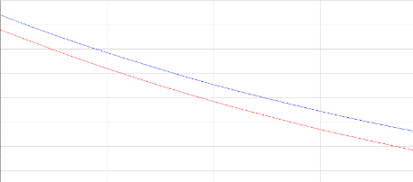

---
## Front matter
lang: ru-RU
title: Лабораторная работа №3
author: Vasily Khuditsky
institute: RUDN University, Moscow, Russian Federation
date: 19 February, 2022 Moscow, Russian Federation
theme: metropolis
documentclass: article
papersize: a4
toc: false
slide_level: 2
aspectratio: 20
section-titles: true
##Fonts
fontsize: 12pt
mainfont: PT Serif
romanfont: PT Serif
sansfont: PT Sans
monofont: PT Mono
mainfontoptions: Ligatures=TeX
romanfontoptions: Ligatures=TeX
sansfontoptions: Ligatures=TeX,Scale=MatchLowercase
monofontoptions: Scale=MatchLowercase,Scale=0.9
---


# <p style="text-align: center;">Лабораторная работа №1</p>


**Автор: Худицкий Василий Олегович**

**Группа: НКНбд-01-19**

<div style="page-break-after: always;">

## Прагматика выполнения работы

- Знакомство с основами математического моделирования на примере простейшей модели боевых действий.

- Визуализация результатов моделирования путем построения графиков.</div>

  <div style="page-break-after: always;">

## Цель выполнения работы


- Научиться строить простейшие математические модели боевых действий - модели Ланчестера.

- Научиться решать систему дифференциальных уравнений</div>

  <div style="page-break-after: always;">
  
  
# Задание

Между страной $X$ и страной $Y$ идет война. Численность состава войск исчисляется от начала войны, и являются временными функциями $x(t)$ и $y(t)$. В начальный момент времени страна $X$ имеет армию численностью *38 000* человек, а в распоряжении страны $Y$ армия численностью в *29 000* человек. Для упрощения модели считаем, что коэффициенты $a$, $b$, $c$, $h$ постоянны. Также считаем $P(t)$ и $Q(t)$ непрерывные функции.

Постройте графики изменения численности войск армии $X$ и армии $Y$ для следующих случаев:

1. Модель боевых действий между регулярными войсками:

   $\frac{dx}{dt}=-0.41x(t)-0.76y(t)+|sin(t+3)|$

   $\frac{dy}{dt}=-0.59x(t)-0.63y(t)+|cos(t+2)|$

2. Модель ведение боевых действий с участием регулярных войск и партизанских отрядов:

   $\frac{dx}{dt}=-0.37x(t)-0.76y(t)+|sin(6t)|$

   $\frac{dy}{dt}=-0.32x(t)-0.61y(t)+|cos(7t)|$</div>

  <div style="page-break-after: always;">

## <p style="text-align: center;">Результаты</p></div> 

  <div style="page-break-after: always;">

## Код программы для первого случая:

   ```Modelica
   model lab3case1
   
     type Soldier=Real(unit="sol", min=0);//тип Солдат с минимальным значением 0
     type Time=Real(unit="d", min=0);//тип Время с минимальным значением 0
     parameter Time t;//параметр времени t
   
     constant Real a = 0.41;//степень влияния различных факторов на потери
     constant Real b = 0.76;//эффективность боевых действий армии у
     constant Real c = 0.59;//эффективность боевых действий армии х
     constant Real h = 0.63;//степень влияния различных факторов на потери
   
     Real p;//размер подкрепления к армии X
     Real q;//размер подкрепления к армии Y
     Soldier x; //численность армии X
     Soldier y; //численность армии Y
     
   initial equation
     x=38000;//начальная численность армии X
     y=29000;//начальная численность армии Y
     t=0;//стартовое время
     
   equation
     p=abs(sin(t+3));//функция, описывающая подкрепление к армии X
     q=abs(cos(t+2));//функция, описывающая подкрепление к армии Y
     der(x)=-a*x-b*y+p;//первое дифференциальное уравнение системы
     der(y)=-c*x-h*y+q;//второе дифференциальное уравнение системы
   
   end lab3case1;
   
   ```

  <div style="page-break-after: always;">

## Код программы для второго случая:

   ```Modelica
   model lab3case2
   
     type Soldier=Real(unit="sol", min=0);//тип Солдат с минимальным значением 0
     type Time=Real(unit="d", min=0);//тип Время с минимальным значением 0
     parameter Time t;//параметр времени t
   
     constant Real a = 0.37;//степень влияния различных факторов на потери
     constant Real b = 0.76;//эффективность боевых действий армии у
     constant Real c = 0.32;//эффективность боевых действий армии х
     constant Real h = 0.61;//степень влияния различных факторов на потери
   
     Real p;//размер подкрепления к армии X
     Real q;//размер подкрепления к армии Y
     Soldier x; //численность армии X
     Soldier y; //численность армии Y
     
   initial equation
     x=38000;//начальная численность армии X
     y=29000;//начальная численность армии Y
     t=0;//стартовое время
     
   equation
     p=abs(sin(6*t));//функция, описывающая подкрепление к армии X
     q=abs(cos(7*t));//функция, описывающая подкрепление к армии Y
     der(x)=-a*x-b*y+p;//первое дифференциальное уравнение системы
     der(y)=-c*x*y-h*y+q;//второе дифференциальное уравнение системы
   
   end lab3case2;
   
   ```

  <div style="page-break-after: always;">

## График для первого случая:

{#fig:001 width=70%} 

  <div style="page-break-after: always;">

 ## График для второго случая:
{#fig:002 width=70%} 

  <div style="page-break-after: always;">
  

 ### <p style="text-align: center;">Спасибо за внимание!</p>