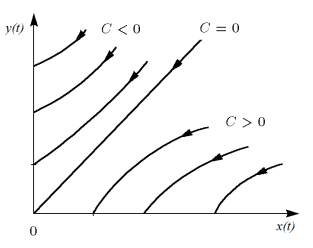
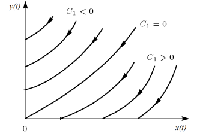
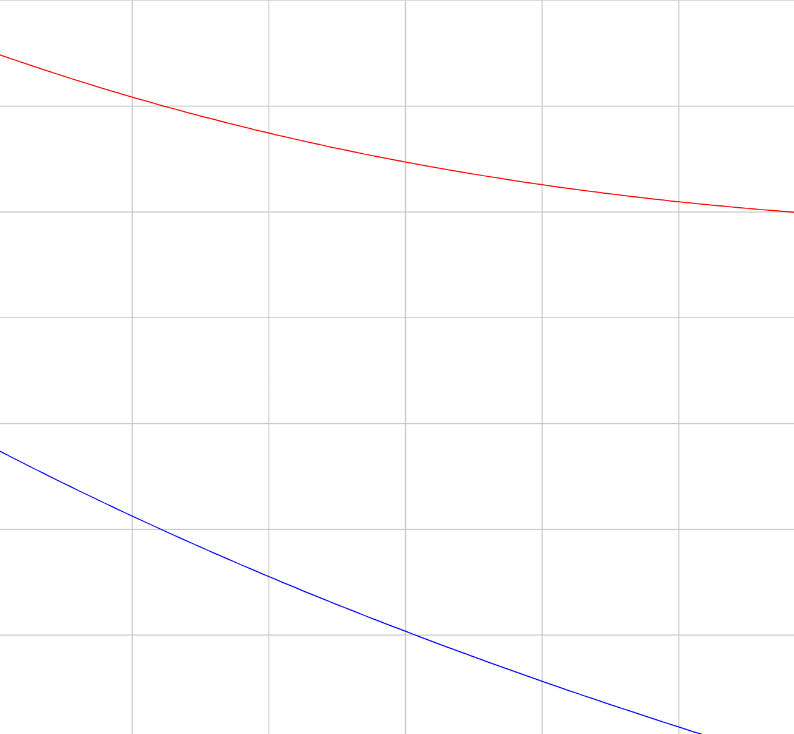
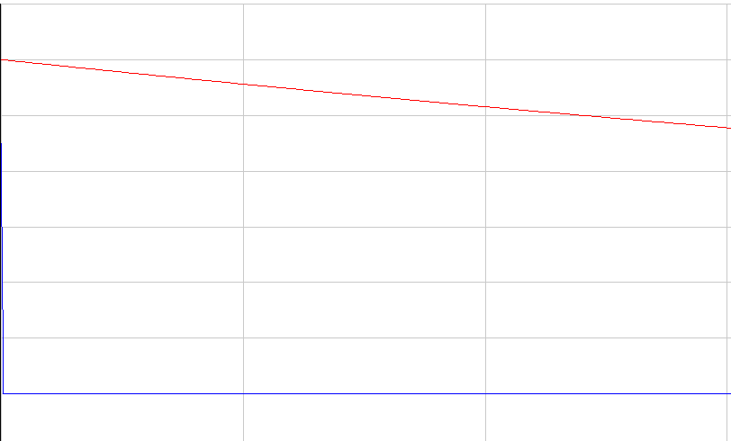

---
# Front matter
title: "Отчёт по лабораторной работе №2"
subtitle: "Вариант 44"
author: "Василий Олегович Худицкий"

# Generic otions
lang: ru-RU
toc-title: "Содержание"

# Pdf output format
toc: true # Table of contents
toc_depth: 2
lof: true # List of figures
lot: true # List of tables
fontsize: 12pt
linestretch: 1.5
papersize: a4
documentclass: scrreprt
## I18n
polyglossia-lang:
  name: russian
  options:
	- spelling=modern
	- babelshorthands=true
polyglossia-otherlangs:
  name: english
### Fonts
mainfont: PT Serif
romanfont: PT Serif
sansfont: PT Sans
monofont: PT Mono
mainfontoptions: Ligatures=TeX
romanfontoptions: Ligatures=TeX
sansfontoptions: Ligatures=TeX,Scale=MatchLowercase
monofontoptions: Scale=MatchLowercase,Scale=0.9
## Biblatex
biblatex: true
biblio-style: "gost-numeric"
biblatexoptions:
  - parentracker=true
  - backend=biber
  - hyperref=auto
  - language=auto
  - autolang=other*
  - citestyle=gost-numeric
## Misc options
indent: true
header-includes:
  - \linepenalty=10 # the penalty added to the badness of each line within a paragraph (no associated penalty node) Increasing the value makes tex try to have fewer lines in the paragraph.
  - \interlinepenalty=0 # value of the penalty (node) added after each line of a paragraph.
  - \hyphenpenalty=50 # the penalty for line breaking at an automatically inserted hyphen
  - \exhyphenpenalty=50 # the penalty for line breaking at an explicit hyphen
  - \binoppenalty=700 # the penalty for breaking a line at a binary operator
  - \relpenalty=500 # the penalty for breaking a line at a relation
  - \clubpenalty=150 # extra penalty for breaking after first line of a paragraph
  - \widowpenalty=150 # extra penalty for breaking before last line of a paragraph
  - \displaywidowpenalty=50 # extra penalty for breaking before last line before a display math
  - \brokenpenalty=100 # extra penalty for page breaking after a hyphenated line
  - \predisplaypenalty=10000 # penalty for breaking before a display
  - \postdisplaypenalty=0 # penalty for breaking after a display
  - \floatingpenalty = 20000 # penalty for splitting an insertion (can only be split footnote in standard LaTeX)
  - \raggedbottom # or \flushbottom
  - \usepackage{float} # keep figures where there are in the text
  - \floatplacement{figure}{H} # keep figures where there are in the text
---

# Цель работы

Рассмотреть некоторые простейшие модели боевых действий – ***модели Ланчестера***, а также их программную реализацию.

# Задание

Между страной $X$ и страной $Y$ идет война. Численность состава войск исчисляется от начала войны, и являются временными функциями $x(t)$ и $y(t)$. В начальный момент времени страна $X$ имеет армию численностью *38 000* человек, а в распоряжении страны $Y$ армия численностью в *29 000* человек. Для упрощения модели считаем, что коэффициенты $a$, $b$, $c$, $h$ постоянны. Также считаем $P(t)$ и $Q(t)$ непрерывные функции.

Постройте графики изменения численности войск армии $X$ и армии $Y$ для следующих случаев:

1. Модель боевых действий между регулярными войсками:

   $\frac{dx}{dt}=-0.41x(t)-0.76y(t)+|sin(t+3)|$

   $\frac{dy}{dt}=-0.59x(t)-0.63y(t)+|cos(t+2)|$

2. Модель ведение боевых действий с участием регулярных войск и партизанских отрядов:

   $\frac{dx}{dt}=-0.37x(t)-0.76y(t)+|sin(6t)|$

   $\frac{dy}{dt}=-0.32x(t)-0.61y(t)+|cos(7t)|$

# Теоретическое введение

Динамическая модель Ланчестера, или закон Ланчестера о ходе сражения, является инструментом теоретического прогноза результатов ведения боевых действий. Следует отметить, что в это же время аналогичные модели исследовал М. Осипов, математические результаты которого были аналогичными.

Модель Ланчестера – Осипова описывает динамику истощения (Attrition) численности воюющих сторон в зависимости от их показателей эффективности ведения боевых действий.

Эта простейшая модель неоднократно модифицировалась в зависимости от типа боевых действий: применение артиллерии, партизанская или повстанческая войны, возможность задействовать резервы, условия, приводящие к хаотическому поведению, учет иерархии, игровых и психологических.


# Выполнение лабораторной работы

## 1. Постановка задачи

Рассмотрим некоторые простейшие модели боевых действий – модели Ланчестера (Осипова — Ланчестера). В противоборстве могут принимать участие как регулярные войска, так и партизанские отряды. В общем случае главной характеристикой соперников являются численности сторон. Если в какой-то момент времени одна из численностей обращается в нуль, то данная сторона считается проигравшей (при условии, что численность другой стороны в данный момент положительна).

Рассмотрим два случая ведения боевых действий:

1. Боевые действия между регулярными войсками.
2. Боевые действия с участием регулярных войск и партизанских отрядов.

### 1.1. Боевые действия между регулярными войсками

#### Модель

В первом случае численность регулярных войск определяется тремя факторами:

- скорость уменьшения численности войск из-за причин, не связанных с боевыми действиями (болезни, травмы, дезертирство).
- скорость потерь, обусловленных боевыми действиями противоборствующих сторон (что связанно с качеством стратегии, уровнем вооружения, профессионализмом солдат и т.п.).
- скорость поступления подкрепления (задаётся некоторой функцией от времени).

В этом случае модель боевых действий между регулярными войсками описывается следующим образом:

$\frac{dx}{dt}=-a(t)x(t)-b(t)y(t)+P(t)$

$\frac{dy}{dt}=-c(t)x(t)-h(t)y(t)+Q(t)$

где:

- члены $-a(t)x(t)$ и $-h(t)y(t)$ описывают потери, не связанные с боевыми действиями, а $a(t)$ и $h(t)$ - величины, характеризующие степень влияния различных факторов на потери.
- члены $-b(t)y(t)$ и $-c(t)x(t)$ отражают потери на поле боя, а $b(t)$ и $c(t)$ - величины, которые указывают на эффективность боевых действий.
- функции $P(t)$ и $Q(t)$ учитывают возможность подхода подкрепления к войскам $X$ и $Y$ в течение одного дня.


В простейшей модели борьбы двух противников:

- коэффициенты $b(t)$ и $c(t)$ являются постоянными, то есть, предполагается, что каждый солдат армии $x$ убивает за единицу времени $c$ солдат армии $y$ (и, соответственно, каждый солдат армии $y$ убивает $b$ солдат армии $x$).

- не учитываются потери, не связанные с боевыми действиями.
- не учитывается возможность подхода подкрепления.

Состояние системы описывается точкой $(x,y)$ положительного квадранта плоскости. Координаты этой точки, $x$ и $y$ - это численности противостоящих армий. Тогда модель принимает вид:

$\begin{cases} \stackrel{.}{x}=-by \\ \stackrel{.}{x=y}=-cx \end{cases}$

Это жесткая модель, которая допускает точно решение:

$\frac{dx}{dy}=\frac{by}{cx}$

$cxdx=bydy$, $cx^2-by^2=C$

Эволюция численностей армий x и y происходит вдоль гиперболы, заданной этим уравнением (рис. [-@fig:001]). По какой именно гиперболе пойдет война, зависит от начальной точки:

{#fig:001 width=70%}

 Эти гиперболы разделены прямой $\sqrt{c}x=\sqrt{b}y$ :

- Если начальная точка лежит выше этой прямой, то гипербола выходит на ось $y$, т.е. побеждают партизаны.

  *Пояснение:* это значит, что в ходе войны численность армии $x$ уменьшается до нуля (за конечное время). Армия $y$ выигрывает, противник уничтожен.

- Если начальная точка лежит ниже этой прямой, то гипербола выходит на ось $x$, т.е. побеждает регулярная армия.

  *Пояснение:* это значит, что в ходе войны численность армии $y$ уменьшается до нуля (за конечное время). Армия $x$ выигрывает, противник уничтожен.

- Если начальная точка лежит на прямой, то война заканчивается истреблением обеих армий.

  *Пояснение:* но на это требуется бесконечно большое время: конфликт продолжает тлеть, когда оба противника уже обессилены.

### 1.2. Боевые действия с участием регулярных войск и партизанских отрядов

#### Модель

Во втором случае в борьбу добавляются партизанские отряды. Нерегулярные войска в отличии от постоянной армии менее уязвимы, так как действуют скрытно, в этом случае сопернику приходится действовать неизбирательно, по площадям, занимаемым партизанами. Поэтому считается, что тем потерь партизан, проводящих свои операции в разных местах на некоторой известной территории, пропорционален не только численности армейских соединений, но и численности самих партизан. 

В результате модель принимает вид:

$\frac{dx}{dt}=-a(t)x(t)-b(t)y(t)+P(t)$

$\frac{dy}{dt}=-c(t)x(t)y(t)-h(t)y(t)+Q(t)$

*Пояснение:*

- члены $-a(t)x(t)$ и $-h(t)y(t)$ описывают потери, не связанные с боевыми действиями, где:
  - $a(t)$ и $h(t)$ - величины, характеризующие степень влияния различных факторов на потери.
- члены $-b(t)y(t)$ и $-c(t)x(t)$ отражают потери на поле боя, где:
  - $b(t)$ и $c(t)$ - величины, которые указывают на эффективность боевых действий со стороны $y$ и $x$ соответственно.
- функции $P(t)$ и $Q(t)$ учитывают возможность подхода подкрепления к войскам $X$ и $Y$ в течение одного дня.


В простейшей модели борьбы двух противников:

- коэффициенты $b(t)$ и $c(t)$ являются постоянными.

  *Пояснение:* Попросту говоря, предполагается, что каждый солдат армии $x$ убивает за единицу времени $c$ солдат армии $y$ (и, соответственно, каждый солдат армии $y$ убивает $b$ солдат армии $x$).

- не учитываются потери, не связанные с боевыми действиями.

- не учитывается возможность подхода подкрепления.

Если рассматривать второй случай с теми же упрощениями, то модель принимает вид:

$\frac{dx}{dt}=-by(t)$

$\frac{dy}{dt}=-cx(t)y(t)$

Эта система приводится к уравнению:

$\frac{d}{dt}(\frac{b}{2}x^2(t)-cy(t))=0$,

которое при заданных начальных условиях имеет единственное решение (рис. [-@fig:002]):

$\frac{b}{2}x^2(t)-cy(t)=\frac{b}{2}x^2(0)-cy(0)=C_1$

{#fig:002 width=70%}

Эти гиперболы разделены параболой $\frac{b}{2}x^2(0)=cy(0)$ :

- при $C_1<0$ побеждают партизаны.

  *Пояснение:* это значит, что в ходе войны численность армии $x$ уменьшается до нуля (за конечное время). Армия $y$ выигрывает, противник уничтожен.

- при $C_1>0$ побеждает регулярная армия.

  *Пояснение:* это значит, что в ходе войны численность армии $y$ уменьшается до нуля (за конечное время). Армия $x$ выигрывает, противник уничтожен.

## 2. Построение графиков изменения численности войск

### 2.1. Боевые действия между регулярными войсками

1. Код программы на Modelica:

   ```matlab
   model lab3case1
   
     type Soldier=Real(unit="sol", min=0);//тип Солдат с минимальным значением 0
     type Time=Real(unit="d", min=0);//тип Время с минимальным значением 0
     parameter Time t;//параметр времени t
   
     constant Real a = 0.41;//степень влияния различных факторов на потери
     constant Real b = 0.76;//эффективность боевых действий армии у
     constant Real c = 0.59;//эффективность боевых действий армии х
     constant Real h = 0.63;//степень влияния различных факторов на потери
   
     Real p;//размер подкрепления к армии X
     Real q;//размер подкрепления к армии Y
     Soldier x; //численность армии X
     Soldier y; //численность армии Y
     
   initial equation
     x=38000;//начальная численность армии X
     y=29000;//начальная численность армии Y
     t=0;//стартовое время
     
   equation
     p=abs(sin(t+3));//функция, описывающая подкрепление к армии X
     q=abs(cos(t+2));//функция, описывающая подкрепление к армии Y
     der(x)=-a*x-b*y+p;//первое дифференциальное уравнение системы
     der(y)=-c*x-h*y+q;//второе дифференциальное уравнение системы
   
   end lab3case1;
   
   ```
   
2. График изменения численности войск армии $X$ и армии $Y$ (рис. [-@fig:003]):

   {#fig:003 width=70%}
   
   Легенда:
   
   - <span style="color:red">красный</span> - регулярная армия $X$;
   - <span style="color:blue">синий</span> - регулярная армия $Y$;

### 2.2. Боевые действия с участием регулярных войск и партизанских отрядов

1. Код программы на Modelica:

   ```matlab
   model lab3case2
   
     type Soldier=Real(unit="sol", min=0);//тип Солдат с минимальным значением 0
     type Time=Real(unit="d", min=0);//тип Время с минимальным значением 0
     parameter Time t;//параметр времени t
   
     constant Real a = 0.37;//степень влияния различных факторов на потери
     constant Real b = 0.76;//эффективность боевых действий армии у
     constant Real c = 0.32;//эффективность боевых действий армии х
     constant Real h = 0.61;//степень влияния различных факторов на потери
   
     Real p;//размер подкрепления к армии X
     Real q;//размер подкрепления к армии Y
     Soldier x; //численность армии X
     Soldier y; //численность армии Y
     
   initial equation
     x=38000;//начальная численность армии X
     y=29000;//начальная численность армии Y
     t=0;//стартовое время
     
   equation
     p=abs(sin(6*t));//функция, описывающая подкрепление к армии X
     q=abs(cos(7*t));//функция, описывающая подкрепление к армии Y
     der(x)=-a*x-b*y+p;//первое дифференциальное уравнение системы
     der(y)=-c*x*y-h*y+q;//второе дифференциальное уравнение системы
   
   end lab3case2;
   
   ```
   
2. График изменения численности войск армии $X$ и армии $Y$ (рис. [-@fig:004]):

   {#fig:004 width=70%}
   
   Легенда:
   
   - <span style="color:red">красный</span> - регулярная армия $X$;
   - <span style="color:blue">синий</span> - партизанский отряд $Y$;

# Выводы

Благодаря данной лабораторной работе познакомился с простейшей моделью боевых действий — моделью Ланчестера, и научился:

- строить эту модель для следующих двух случаев:
  - Модель боевых действий между регулярными войсками.
  - Модель ведение боевых действий с участием регулярных войск и партизанских отрядов.

- строить графики изменений численности войск армии $X$ и армии $Y$ для следующих двух случаев:
  - Модель боевых действий между регулярными войсками.
  - Модель ведение боевых действий с участием регулярных войск и партизанских отрядов.


# Список литературы

- <code>[Кулябов Д.С. *Лабораторная работа №3*](https://esystem.rudn.ru/mod/resource/view.php?id=831037)</code>
- <code>[Кулябов Д.С. *Задания к лабораторной работе №3 ( по вариантам )*](https://esystem.rudn.ru/mod/resource/view.php?id=831038)</code>
- <code>[Wikipedia *Законы Осипова-Ланчестера*](https://ru.wikipedia.org/wiki/Законы_Осипова_—_Ланчестера)</code>
- В. В. Бреер, “Пороговые модели боевых действий”, *УБС*, **84** (2020), 35–50